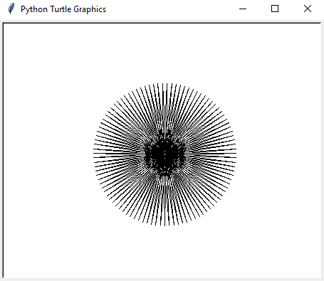
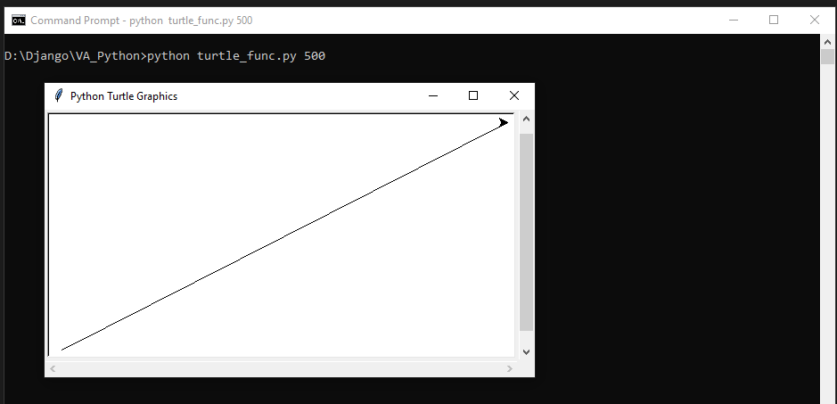
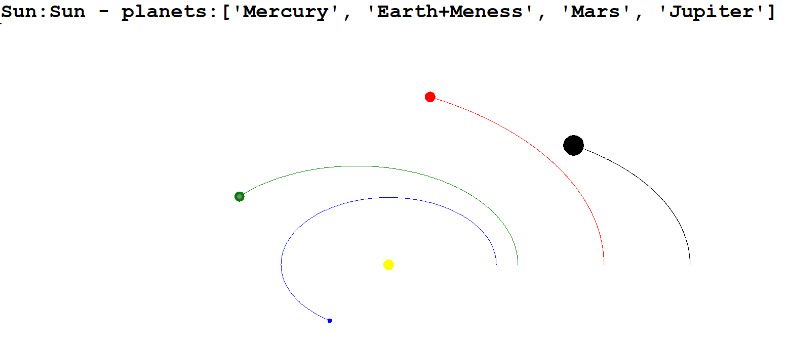

# PythonUML

Te faili priekš Python un OOP kursa

## PD2: 2.2.Turtle - zīmēšana zvaigzne un funkcija

python turtle_star.py 99

python turtle_func.py 500

## PD4: 2.4.Solar - Saules sistēma

python solar_system_g02_pd4.py

## PD5: 3.2 Animals - Zivis un Lāči

python sim1.py

## PD6: 3.4 Draw - Zīmēšana

python drawG02.py

